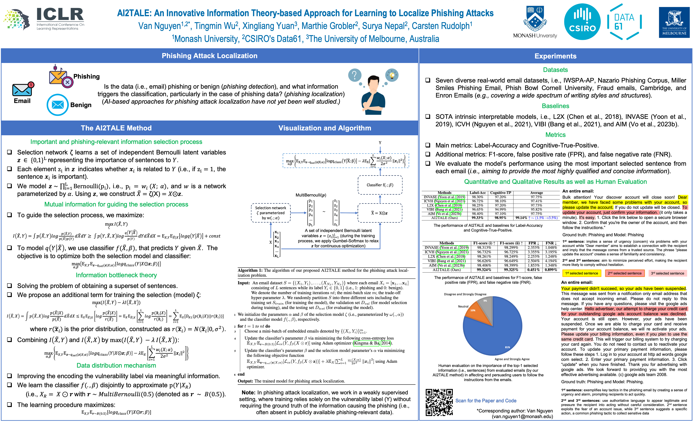

# AI2TALE

This repository contains source code samples for reproducing the experiments of our proposed AI2TALE method in our paper "AI2TALE: An Innovative Information Theory-based Approach for Learning to Localize Phishing Attacks", published as a conference paper at the International Conference on Learning Representations (ICLR), 2025 (https://openreview.net/pdf?id=3xpTXF5ALZ). Refer to the AI2TALE.png file for the poster of our paper.

      

## Dependencies
We implemented our proposed AI2TALE method in Python using Tensorflow (version 2.9.0) and Python (version 3.9). Other required packages are keras, scikit-learn, numpy, scipy, nltk, and pickle.

## Datasets
The "phishingdata" folder contains all the data files needed for the training and testing (inference) processes of our proposed AI2TALE method. Please download this folder including all of its files at [https://drive.google.com/drive/folders/1xdShRTCu_EvdRzccszcR8RyUwVG4lJYd?usp=sharing](https://drive.google.com/drive/folders/1-ob6rJ-Cl6r4u2rs6v_4v85PBQwwHt6V?usp=sharing).

## Running AI2TALE
To train our proposed AI2TALE, run the following command, for example: *python ai2tale.py --train*

Note that: in the above command, we use the sample and default values for the hyperparameters. To change the value of the hyperparameters such as the learning rate, the batch size, and the trade-off, please change the corresponding arguments (refer to the *__main__* function in ai2tale.py for details).

To generate the selected data for the testing set using our AI2TALE trained model, run the following command, for example: *python ai2tale.py*

Note that: please also set the values for the hyperparameters as used in the training process. That will be useful to locate the corresponding trained model.

## Measures
To obtain the values for the metrics (i.e., Label-Accuracy, Cognitive-True-Positive, F1-score, FPR, FNR) used in our paper, run the following command, for example: *python ai2tale_measures.py*

Note that: please set the values for the hyperparameters as used in the testing process. That will be useful for locating the corresponding folder where the selected data is saved.

## Pre-trained models and results
The "ai2tale_k1_tau0.5" folder contains our pre-trained models and corresponding results. Please download this folder including all of its files at [https://drive.google.com/drive/folders/1c1L3R9atwLSTXMrc6UXLaVzl0cJth4en?usp=sharing](https://drive.google.com/drive/folders/1AXJOECfraWE4BV0NHmdP00a6VgBMSuF_?usp=sharing).

## Citation

If you reference our paper (and/or) use our source code samples in your work, please kindly cite our paper.

@inproceedings{nguyen-ai2tale-iclr2025, 
      author={Van Nguyen and Tingmin Wu and Xingliang Yuan and Marthie Grobler and Surya Nepal and Carsten Rudolph}, 
      title={AI2TALE: An Innovative Information Theory-based Approach for Learning to Localize Phishing Attacks}, 
      booktitle={The Thirteenth International Conference on Learning Representations (ICLR)}, 
      year={2025} 
}
